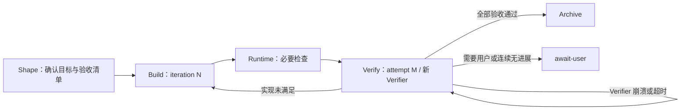
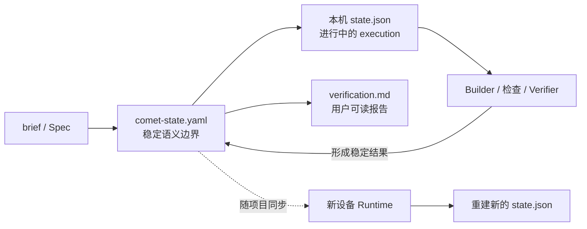

# Native Runtime 独立验收、有界 Loop 与可携带恢复重构设计

> 状态：Implemented on `beta17`（发布版本 `0.4.0-beta.17`）
> 设计基线：`0.4.0-beta.17`（`38e2aee0`）
> 影响范围：Native Runtime、Native 中英文 Skill、Dashboard、Native 测试与真实 Agent Eval

> 实施记录（2026-08-09）：本文设计已落到 beta17。新 Native 路径使用 portable `comet-state.yaml`、本机 `state.json`/logs 和 Build↔Verify Loop；正常路径不创建或读取项目 snapshot、项目内容哈希、receipt、evidence、trajectory 或独立 checkpoint。旧模块仍仅为迁移/legacy 只读兼容，不参与新 change 的正常验收。

> 交付证据：真实 Agent Eval 完成 10 次 CLI 往返；第一次新的 Verifier 发现 Builder 漏掉 A2，Runtime 返回 Build；修复后由第二个新的 Verifier 完成全量验收，通用 CLI 先停在 `await-user`，明确确认后 Archive。长 stdout/stderr、Windows `pnpm` shim、跨设备 overlay 重建、Archive 不重验和升级清理均有自动化回归。真实模型 Eval 不能证明所有项目语义都能被发现，因此该边界仍由 Verifier 选择质量和用户确认承担。

## 一、决策摘要

Native 验收从“项目快照、文件哈希、内容寻址证据、receipt 绑定和 Archive 重验”重构为：

1. Shape 一次性形成用户可读的验收清单。
2. Builder Agent 负责实现，但没有宣布完成的权限。
3. Runtime 在候选实现上执行或复用必要检查。
4. Runner 分派一个新的 Verifier Agent execution，对当前实现逐项验收。
5. Runtime 只根据完整的验收结果决定通过、返回 Build 或等待用户。
6. Build 与 Verify 之间保留有界 Loop；Archive 不再重复验收。
7. `comet-state.yaml` 在稳定工作流边界保存可随仓库移动的语义检查点；本机 `state.json` 只保存正在执行的 operation。

新设计不在正常 Native 生命周期中创建项目快照、计算项目文件哈希、生成内容寻址证据，或要求 Agent 维护 receipt/evidence 引用链。

可靠性由以下事实提供：

- 实现者与验收者分离；
- 必要命令确实由 Runtime 执行或被 Runtime 确认可复用；
- Verifier 必须覆盖全部验收项；
- 非零退出、超时、未运行、未知结论不能被包装成通过；
- 失败会携带明确缺口回到 Build，而不是由 Agent 自信地结束任务；
- Loop 有停滞判断和总轮次上限，不会无限消耗。
- 新 Agent 可以只根据同步后的正式产物恢复，不依赖旧聊天记录或旧 subagent execution。

## 二、背景与问题

beta.17 的 Native Verify 在小范围改动上仍可能付出远超实现本身的成本。一次只修改少量文件的 change，可能在 Verify 中经历：

- 多次全项目 snapshot 和 freshness 检查；
- 为大量细粒度验收项逐条创建 receipt、再组装 evidence；
- Verify 与 Archive 重复检查相同事实；
- 命令输出先允许保留较大内容，随后又被更小的文本字段上限拒绝；
- Agent 因 CLI 格式、Shell 差异或引用漂移不断重试。

这类问题不能全部归因于 Agent。Agent 的错误操作会增加耗时，但当前 Runtime 把简单验收扩展成了需要维护多份派生状态的协议；任何一处引用、摘要或文件状态不一致，都会把 Agent 推入新的诊断循环。

与此同时，直接相信 Builder 的“已经完成”也不可靠。业界 Agent Eval 的共同结论是：应验证最终 outcome，而不是把 Agent 的自述当作结果；Evaluator 与实现调用分离，通常比同一上下文中的自我复核更可靠。相关参考：

- [Anthropic: Building effective agents](https://www.anthropic.com/engineering/building-effective-agents)
- [Anthropic: Demystifying evals for AI agents](https://www.anthropic.com/engineering/demystifying-evals-for-ai-agents)
- [OpenAI: Graders](https://platform.openai.com/docs/api-reference/graders)
- [Large Language Models Cannot Self-Correct Reasoning Yet](https://arxiv.org/abs/2310.01798)

这些资料分别支持“生成与评价分离”“围绕最终产物和明确 rubric 验收”“程序化检查与模型判断可以组合”以及“不能只依赖模型无外部反馈的自我纠错”。本设计据此做出的工程推论是：删除过重的完整性证明机制，同时保留独立验收、结果完整性检查和失败修复 Loop；它们并不意味着任意模型 Verifier 都一定正确。

## 三、目标

### 3.1 可靠验收

- Builder 只能提交“候选完成”，不能直接产生最终通过。
- 每次语义验收由新的 Verifier execution 完成，默认优先使用 subagent。
- Runtime 必须校验 Verifier 是否覆盖全部验收项，拒绝重复、未知或缺失 ID。
- 检查命令的退出状态、超时和执行错误由 Runtime 记录，不接受自由文本改写结果。
- 没有充分判断的信息必须是 `blocked` 或 `unknown`，不能默认为 `pass`。

### 3.2 高效验收

- 正常 Verify 不做项目 snapshot、全项目枚举或项目文件哈希。
- 不按验收项调用 CLI，不为每项验收创建一个独立文件。
- 正常、未中断的候选验收中，每个必要检查在同一实现状态上最多执行一次；崩溃恢复不伪装成 exactly-once。
- 默认一个候选实现只分派一个 Verifier；Verifier execution 失败，或宿主无法恢复等待检查结果的 execution 时才启动新的 attempt。
- Archive 只负责关闭 change 和应用正式 Spec，不重新运行 Verify。

### 3.3 简单、可恢复的 Runtime

- 一个 active change 只有一份可携带的语义权威：`comet-state.yaml`。
- 本机 `state.json` 是进行中 execution 的临时覆盖层；缺失或版本不匹配时从正式产物重建。
- 命令输出使用流式日志，不把任意长度的项目输出塞入 JSON 摘要字段。
- 在稳定工作流边界原子写入 YAML；不再维护 snapshot、receipt、evidence、trajectory 和独立 checkpoint 多套恢复链。
- 跨设备从最近一次已同步的稳定边界恢复，不尝试续接旧设备上进行到一半的模型或子进程。
- Dashboard 直接读取轻量状态，不通过详情页间接触发完整验收图检查。

### 3.4 清晰的用户产物

- 用户只需要理解需求、目标行为和验收结论三类 Markdown。
- Runtime 状态不得伪装成用户文档。
- Archive 后不保留项目本地 Runtime 垃圾。

## 四、非目标与保证边界

本设计不尝试：

- 提供项目目录在任意两个时刻完全相同的密码学证明；
- 检测绕过 Comet、由外部编辑器或后台进程完成的所有并发写入；
- 假设用户拥有 CI、容器或远程执行基础设施；
- 证明测试选择本身一定充分、断言一定正确或生产环境一定等同于本地环境；
- 让 Runtime 代替 Verifier 判断所有项目语义。
- 跨设备续接同一个正在运行的 Agent execution、tool call 或子进程；
- 恢复尚未提交、推送或通过共享工作区同步到新设备的实现内容。
- 允许两个设备同时推进同一个 active change；跨设备恢复是旧设备停止后的串行 handoff。

Runtime 能保证的是：在它控制的执行序列中，命令真实运行、结果未被 Agent 改写、验收项被完整作答、Builder 与 Verifier execution 分离、失败不会被当成完成。

如果宿主能提供写入动作事件，Verify 期间观察到实现写入时，Runtime 必须取消当前验收并返回 Build。如果宿主无法提供该事件，Runtime 不得声称能够发现外部并发修改。

## 五、职责边界

### 5.1 Skill

Skill 是面向 Agent 的操作说明，负责：

- 指导 Shape 形成具体、可判断的验收项；
- 告诉 Builder 何时提交候选实现；
- 告诉 Verifier 不信任 Builder 的完成声明；
- 要求 Verifier 检查实际实现、项目说明和真实命令结果；
- 根据 Runtime 返回的下一动作继续 Loop。

Skill 不保存权威状态，也不能自行把 change 标记为通过。

### 5.2 Runner / 宿主

Runner 负责 Agent execution：

- 启动 Builder；
- Builder 提交候选后启动新的 Verifier subagent 或独立 execution；
- 为 Builder 和 Verifier 注入宿主生成、全局唯一且 Agent 无法通过 CLI 自填的 opaque execution identity；
- 根据 Runtime 的 `continue` 自动触发下一轮；
- 在 `await-user`、`blocked` 或 `done` 时停止；
- 在支持的平台上把实现写入动作通知 Runtime。

不支持 subagent 的宿主必须使用新的隔离 Agent execution。若连独立 execution 或可信 identity 都无法提供，只能降级为确定性检查加用户确认，不能静默使用同一 Builder 产生“独立验收通过”。Agent 提交的普通字符串、命令参数或报告字段不能充当 execution identity。

### 5.3 Runtime

Runtime 只负责确定性工作：

- 稳定语义状态推进、本机中断恢复和跨设备受控重建；
- 验收清单的结构完整性；
- 检查计划、命令执行和结果记录；
- Verifier 输出的 schema 与覆盖完整性；
- Loop 计数、进展判断和停止条件；
- 持久化下一动作与精简 Builder handoff，使新 Agent 无聊天上下文也能继续；
- 生成用户可读的 `verification.md`；
- Archive 的原子文件操作。

### 5.4 Builder

Builder 负责修改项目、运行开发期的最小相关检查、解释本轮修复，并提交候选实现。Builder 不得修改验收结论，也不得直接进入 Archive。

### 5.5 Verifier

Verifier 是只读验收角色，负责：

- 阅读当前 brief、目标 Spec、项目说明和实际实现；
- 检查 Builder 是否遗漏需求或只完成表面路径；
- 使用 Runtime 已执行的检查结果，并在必要时申请额外检查；
- 对每个验收项返回 `passed`、`failed` 或 `blocked`；
- 给出可供下一轮 Build 直接处理的具体原因。

Verifier 不修改实现，也不自己推进 Runtime 状态。

## 六、状态机与 Loop

Loop 不是第五阶段，而是 Verify 失败后返回 Build 的正式路径。



### 6.1 iteration 与 attempt

- `iteration` 表示一次完整的 Build → Verify 实现轮次。
- 首次进入 Build 时 `iteration = 1`。
- 有效 Verifier 结果包含实现失败时，返回 Build 并令 `iteration += 1`。
- `attempt` 表示同一 iteration 上为 Verifier execution 保留的单调序号。
- 每次分派新的 Verifier 前，Runtime 必须先在 YAML 中原子写入 `attempt += 1` 和 `state_version += 1`，再以该版本写本机 operation，最后请求宿主启动 execution；第一次为 1。
- 如果在序号持久化后、宿主实际启动前中断，该 attempt 记为基础设施中断；恢复后保留下来的序号不复用，再为新的 execution 增加一次 attempt。
- Verifier 崩溃、超时、输出结构无效，或宿主不能恢复等待检查结果的 execution 时，留在 Verify 并启动下一个 attempt。
- 连续三个 attempt 没有产生有效 `final-result` 时进入 `blocked`，不再自动分派；`execution_failure_count` 在得到有效结果或开始新 iteration 时清零，不占用 `native.max_verify_failures` 的实现失败预算。
- 实现失败不是 Verifier execution 失败；它开始新的 iteration，而不是重试 attempt。
- 新 iteration 开始时 `attempt = 0`，直到新的 Verifier execution 启动。
- `blocked` 条件解除后，如果实现没有变化，显式 `retry-verifier` 动作先令 `retry_epoch += 1`、清零 `execution_failure_count`，再启动新的 Verifier execution；如果解决条件需要修改实现，则开始新的 iteration。

示例：

```text
iteration 1 / attempt 1：Verifier 超时
iteration 1 / attempt 2：A3、A5 未满足
iteration 2 / attempt 1：修复后全部通过
```

### 6.2 Loop 状态

Runtime 对 Dashboard 和 Runner 暴露以下状态：

```text
building
checking
verifying
repairing
archiving
await-user
blocked
done
```

`repairing` 仍属于 Build，`checking` 和 `verifying` 仍属于 Verify，`archiving` 属于 Archive。它们是 Loop 的执行状态，不是新的 Native phase。

### 6.3 终态

- `done`：全部验收通过且 Archive 已完成。
- `await-user`：需要用户判断、外部条件或独立验收无法提供。
- `blocked`：Runtime 无法安全恢复，或已经达到明确的停止条件。

`continue` 只是要求 Runner 触发下一次 execution，不是完成状态。

## 七、验收执行流程

### 7.1 Shape：形成验收清单

Shape 需要产出非空、可观察、互不重复的验收项。使用简单可读的顺序 ID：

```text
A1
A2
A3
```

ID 只用于结果映射，不由内容计算，不代表文件身份。Runtime 在 Shape 确认时把验收项及其来源文字写入 `comet-state.yaml`。进入 Verify 前只重新读取小型正式文档，并与已确认的 ID、文字和来源逐项比较；不扫描项目树。

用户在 Build 或 Verify 中改变 brief、目标 Spec 或验收项时，当前候选必须失效并返回 Shape 完成确认。Runtime 直接比较重新解析后的验收 ID、文字和目标 Spec 声明，不计算文档哈希。只有用户再次确认新的验收清单后，才开始新的目标周期并清空旧 Verifier 结论。

### 7.2 Build：提交候选实现

Builder 可以运行开发期最小检查，但这些检查只用于实现反馈。提交候选时必须提供：

- 本轮实现摘要；
- 针对上一轮失败项的修复说明；
- 已运行检查及未运行原因；
- 已知限制。

这些内容在候选提交这个稳定边界写入 `comet-state.yaml` 的精简 `builder_handoff`，并在最终报告中展示，不产生独立 `implementation.md`。handoff 只保存恢复下一步所需的摘要、已运行检查和已知限制，不复制命令完整输出或逐文件内容；显示截断不得使候选失效。

Runtime 为候选生成随机 `candidate_id`。强 host adapter 从平台调度器取得 Builder/Verifier identity，通过 in-process branded API 提交 opaque execution ref；同一 provider 下 Builder 与 Verifier ref 必须不同。只有这条路径可以声称 host-attested 身份分离。跨设备后 provider 不可比较时，先由新平台上的 Builder 重新提交候选，再分派新的 Verifier；不把不可比较的字符串当作证明。

33 平台通用 CLI 使用 `next --runner-input` 的 `skill-coordinated` 桥接。公共 JSON 只含 Builder handoff、显式 check plan、Verifier body 或 execution error，拒绝调用者填写 candidate、identity、provider 或 execution ref。Runtime 自行分配 candidate 与 attempt 关联值并返回完整 `verifierDispatch`。这些程序性 ref 防止误绑和陈旧响应，但任何本地调用者都能调用 CLI，因此不能抵抗恶意调用者伪装多个 Agent，绝不能标为 trusted、runner-attested 或 host-attested。

### 7.3 Runtime：执行必要检查

必要检查来自用户确认的验证预期、项目级说明以及 Runtime/Verifier 的项目发现。Skill/Runner 必须显式解析检查计划；项目确实没有适用命令时可以明确解析为 `checks: []`，但这不免除 Verifier 覆盖全部验收项。检查计划使用可执行文件、参数、工作目录和超时，不依赖 Agent 拼接一段结果文本。Runtime 在短锁内预留计划、释放锁后执行子进程，再在短锁内记录结果；相同已完成计划直接复用，不重复执行，并发中的相同计划报告 already-in-progress，不同计划拒绝覆盖。

检查复用规则：

- 宿主能提供写入动作序列时，只复用“最后一次已观察实现写入之后”由 Runtime 执行的通过检查。
- 宿主无法提供写入动作序列时，不复用 Builder 自报检查；在 Verify 中执行一次最终检查。
- 同一个必要检查不得在一次候选验收中因 preflight、receipt 或 Archive 再次执行。

命令输出直接流式写入日志。JSON 只记录命令、状态、退出码、耗时和日志路径，不保存完整输出摘要。

### 7.4 Verify：独立语义验收

Verifier 获取：

- 用户确认的验收清单；
- brief 和目标 Spec；
- 当前实现；
- Runtime 检查结果；
- Builder 的本轮摘要，但该摘要只作线索。

Verifier 通过两类结构化响应与 Runtime 协作：

```ts
type VerifierResponse =
  | {
      kind: 'request-checks';
      iteration: number;
      attempt: number;
      checks: CheckRequest[];
    }
  | {
      kind: 'final-result';
      result: VerificationResult;
    };

interface TrustedVerifierEnvelope {
  candidate_id: string;
  identity_provider: string;
  verifier_execution_ref: string;
  payload: VerifierResponse;
}
```

`VerifierResponse` 是 Agent 生成的 body；`TrustedVerifierEnvelope` 只能由强 host adapter 通过 in-process branded API 附加。通用 CLI 内部也会使用 Runtime 分配的关联 ref 包装 body，但这只叫 `skill-coordinated`，不构成身份声明。两条路径都不接受 Agent 文本、工具参数或 JSON body 中自报的 candidate/provider/execution ref，并校验候选、iteration、attempt 与全部验收 ID。

Verifier body 中的 summary、reason、risk 等诊断文本不设置会使整个响应失效的小字段长度上限；Runtime 校验决策字段后按 9.3 的 `PortableText` 规则生成预览。超长诊断内容可以被标记截断，但不能单独把完整覆盖的 `final-result` 变成 schema error。

`request-checks` 不是验收结论。Runtime 执行检查后，通用 Skill 桥接复用本机 overlay 中由 Runtime 分配的当前 Verifier ref，返回更新后的 `verifierDispatch`，因此可恢复同一个 Verifier 和 attempt；强 host adapter 无法恢复原 execution 时保存检查结果，再启动新 execution 并增加 attempt。

为避免 Verifier 在同一 attempt 内无限调用检查，每个 attempt 最多接受两轮 `request-checks`，每轮必须批量提交当时已知的全部请求。这个预算限制协议往返轮次，不限制单轮合法检查数量或项目规模。Runtime 按规范化的 check ID、可执行文件、argv 和项目相对 cwd 去重；重复请求直接复用已有结果。超过两轮或持续请求等价检查视为 execution error，更新 `execution_failure_count`，不能形成 pass。

强 host-attested pass 可以直接进入 Archive。通用 `skill-coordinated` pass 会先持久化完整 Verifier 结果、真实检查和全量验收映射，但停在 Verify/`await-user`，报告显示 `Passed, user confirmation required`。Skill 说明通用 CLI 无法强证明独立 execution，只询问用户一次是否接受该边界；只有该精确状态下的现有 `next --confirmed --summary` 才清除 blocker 并进入 Archive。三份本地 JSON 不能自行静默归档。

平台既不能启动 subagent、也不能启动新的独立 Agent execution 时，通用桥接可以在显式检查计划已完成且全部通过后提交 `verifier-unavailable`；明确的空计划也必须已由 Runtime 记录为完成。此动作不生成语义验收结论，而是以 `semantic-verification-unavailable` assurance 持久化 degraded `await-user`。只有用户明确确认后，Runtime 才用 `user-confirmed-degraded` assurance 和逐项用户确认原因进入 Archive；报告和 portable state 均不得把它标为 host-attested 或正常独立 pass。

有效 Verifier 的 semantic `blocked` 与 execution error 分开处理。用户判断无需修改实现时，精确的 `resolve-verifier-blocker` 动作保持 candidate 与 iteration，令 `retry_epoch += 1`，清除旧语义结论并复用已完成检查，再预留新 attempt；需要修改实现时仍返回 Build。两条路径都不能静默替用户选择。

最终结果结构为：

```ts
interface VerificationResult {
  iteration: number;
  attempt: number;
  verdict: 'pass' | 'fail' | 'blocked';
  acceptance: Array<{
    id: string;
    result: 'passed' | 'failed' | 'blocked';
    reason: string;
  }>;
  risks: string[];
  summary: string;
}
```

Runtime 只接受：

- 每个已知验收 ID 恰好出现一次；
- 没有未知或重复 ID；
- `pass` 时所有验收项均为 `passed`；
- 必要检查全部成功；
- 结果绑定当前 YAML `builder_handoff.candidate_id`；
- Verifier 与 Builder 的 `identity_provider` 相同，opaque execution ref 不同；
- 两个 execution identity 均由可信宿主通道注入，而不是来自 Agent 提交内容。

### 7.5 Runtime 决策

```text
全部通过            → Archive
存在 failed          → Build，iteration + 1
存在 blocked         → await-user 或 blocked
Verifier execution 错误 → 留在 Verify，启动新 execution 时 attempt + 1
需要额外检查         → 可恢复原 execution 则保持 attempt，否则新 execution
```

Builder 和 Verifier 都不能直接写最终状态，完成决定只由 Runtime 根据结构化结果产生。

### 7.6 Archive

Archive 只负责：

- 必要的用户归档确认；
- 应用正式 Spec；
- 移动 change 目录；
- 清理 active per-change Runtime。

Archive 不重新解析 receipt，不重新计算项目状态，不重新运行检查，也不再次分派 Verifier。

Archive 在用户确认和版本一致的 `archive-ready + pass + verification.md` 之后按固定顺序执行：

1. 在本机全局 transaction 中记录目标 change、完整 Spec 目标路径与当前步骤。
2. 对 create/modify 使用完整目标内容原子替换；对 remove 使用限定在 canonical capability 路径内的受控幂等删除。完成一个路径就推进 transaction step，重复执行得到相同结果。
3. 在 active change 内原子写入 `phase = archive`、`status/stage = done`、`archived = true` 的最终 YAML。
4. 按最终 `state_version` 重新生成 `verification.md`；报告对齐成功前不得移动目录。
5. 将 active change 目录原子移动到 archive；目标已唯一存在且内容状态为 done 时视为可恢复完成，active/archive 同时存在则 blocked。
6. 删除 per-change Runtime 并清理 transaction。

同设备崩溃时优先按 transaction 继续；transaction 丢失时只允许根据 YAML 和 active/archive 唯一位置幂等重放。任何无法唯一判断的混合布局都交给只读 doctor 报告，不得重新 Archive、猜测删除或覆盖。

两个 active change 声明同一 capability 时，不尝试自动合并或判断哪一份内容更新。Archive 在全局锁内重新读取 capability 声明并暂停为 `await-user`，要求用户先确定串行顺序。目标 Spec 是完整替换后的行为，因此被允许 Archive 的 change 直接应用其完整 Spec；不再保存 canonical base hash。绕过 Comet 直接修改 canonical Spec 的情况属于前述外部写入边界。

如果用户在最终通过后提出实现变化，必须返回 Build、开始新的 iteration，并清除当前通过结论。

## 八、进展与停滞

Runtime 不用文件变化量判断是否有进展，只比较有效 Verifier 结果。

```text
unresolved = failed IDs + blocked IDs
```

判断规则：

- 未解决项减少且没有已通过项退化：有进展；
- 未解决项完全相同：无进展；
- 修复部分问题但新增其他失败：不算可靠进展；
- 未解决项增加：退化。

停止规则沿用一个配置，不增加新 CLI：

- 第一次出现相同未解决集合：继续；
- 第二次连续出现：警告 Builder 必须采用不同修复假设；
- 第三次连续出现：`await-user`；
- 总失败轮次继续使用 `native.max_verify_failures`，达到上限后停止自动 Loop。

Verifier 崩溃或输出结构错误不更新语义停滞计数，因为它没有产生有效验收结果。

`failed_iteration_count`、`previous_unresolved_ids` 和 `no_progress_count` 必须直接持久化在 `comet-state.yaml`；同一文件中的 compact history 只用于用户和 Dashboard 展示，不能承担停止判断，`verification.md` 只是它的人类可读投影。只有用户确认了新的验收清单、开始新的 `goal_cycle` 时，才清零语义停滞和总失败轮次。

## 九、正式用户产物

### 9.1 active change

```text
<artifact-root>/comet/changes/<change-name>/
├─ comet-state.yaml
├─ brief.md
├─ specs/
│  └─ <capability>/spec.md
└─ verification.md
```

核心用户可读 Markdown 只有三类：

| 产物                         | 是否必有       | 责任                                         |
| ---------------------------- | -------------- | -------------------------------------------- |
| `brief.md`                   | 是             | 用户目标、范围、决定和验收清单               |
| `specs/<capability>/spec.md` | 按需           | 归档后的完整目标行为                         |
| `verification.md`            | Archive 前必须 | Runtime 根据最新 Verifier 结果生成的可读报告 |

不新增 `implementation.md`。实现摘要属于当前 Loop 状态，最终只需投影到 `verification.md`。

项目级 `.comet/config.yaml` 不是 change Markdown，但它决定 workflow 与 `artifact_root`。为支持非默认产物根的跨设备自动发现，新设计将项目配置视为可同步的项目描述。初始化器必须继续默认忽略 `.comet/*`，只为 `!.comet/config.yaml` 增加精确 allowlist；不得顺带暴露 skills、drafts、cache、Runtime、当前选择、锁或事务。用户不提交项目配置时，另一设备只能使用默认 `docs` 根或显式 `--root`，不能声称自动完成零上下文发现。

停止生成：

```text
evidence.md
repair.md
archive.md
checkpoint.md
```

### 9.2 verification.md

`verification.md` 由 Runtime 根据 YAML 中的 portable verification 状态生成，是人类可读投影，不由 Builder 手写，也不作为完成决定的权威输入。建议结构：

```markdown
---
generated_from_state_version: N
---

# Verification

## Current result

## Acceptance

## Checks

## Blockers

## Risks and skipped work

## Previous iterations

## Conclusion
```

每次有效 Verify 结果先原子推进包含完整 bounded summary 的 YAML，再按该 `state_version` 覆盖生成报告。完整命令输出不嵌入 Markdown。

YAML 是提交点：若 YAML 已推进但报告缺失、`generated_from_state_version` 落后或写入中断，Runtime 可以仅从 YAML 重新生成报告，不重新运行检查或 Verifier；Archive 必须等到该机器可解析整数与 YAML `state_version` 一致。Runtime 只读取 frontmatter 版本做投影对齐，不从 Markdown 正文恢复机器状态，也不会在 YAML 推进前生成“未来版本”的权威报告。

### 9.3 comet-state.yaml

`comet-state.yaml` 是可随 Git 和 Archive 移动的语义状态，也是跨设备恢复的唯一可携带检查点。它只保存稳定工作流边界，不记录进程、绝对路径、日志位置或进行到一半的 tool call。

最小 schema 保存：

```text
schema
name
language
phase
status
state_version
brief
spec_changes
workspace
loop
acceptance
builder_handoff
blockers
verification
history
history_overflow
verification_result
verification_report
archived
created_at
```

其中：

```ts
interface NativePortableState {
  schema: 'comet.native.v4';
  name: string;
  language: 'en' | 'zh-CN';
  phase: 'shape' | 'build' | 'verify' | 'archive';
  status: 'active' | 'await-user' | 'blocked' | 'done';
  state_version: number;
  brief: 'brief.md';
  spec_changes: Array<{
    capability: string;
    operation: 'create' | 'modify' | 'remove';
    source: string | null;
  }>;
  workspace: {
    isolation: 'current' | 'branch' | 'worktree';
    change_branch: string | null;
    target_branch: string | null;
    finish: 'merge' | 'push' | 'pull-request' | 'keep' | null;
  };
  loop: {
    stage:
      | 'shape'
      | 'building'
      | 'verify-ready'
      | 'repairing'
      | 'archive-ready'
      | 'await-user'
      | 'blocked'
      | 'done';
    goal_cycle: number;
    iteration: number;
    attempt: number;
    retry_epoch: number;
    failed_iteration_count: number;
    no_progress_count: number;
    execution_failure_count: number;
    previous_unresolved_ids: string[];
    next_action: string | null;
  };
  acceptance: PortableAcceptanceState[];
  builder_handoff: BuilderHandoff | null;
  blockers: PortableBlockerState[];
  verification: PortableVerificationState | null;
  history: PortableIterationSummary[];
  history_overflow: {
    dropped_entries: number;
    first_dropped_at: string | null;
    last_dropped_at: string | null;
    outcome_counts: Record<string, number>;
  };
  verification_result: 'pending' | 'pass' | 'fail' | 'blocked';
  verification_report: 'verification.md' | null;
  archived: boolean;
  created_at: string;
}

interface PortableAcceptanceState {
  id: string;
  source: string;
  text: string;
  result: 'pending' | 'passed' | 'failed' | 'blocked';
  reason: PortableText | null;
}

interface BuilderHandoff {
  candidate_id: string;
  identity_provider: string;
  builder_execution_ref: string;
  iteration: number;
  summary: PortableText;
  addressed_acceptance_ids: string[];
  checks: Array<{
    name: PortableText;
    result: 'passed' | 'failed' | 'not-run';
    note: PortableText | null;
  }>;
  checks_truncated: boolean;
  known_limits: PortableText[];
  known_limits_truncated: boolean;
  submitted_at: string;
}

interface PortableBlockerState {
  owner: 'builder' | 'runtime' | 'verifier' | 'user' | 'external';
  reason: PortableText;
  acceptance_ids: string[];
  resolution_action:
    | 'return-build'
    | 'retry-verifier'
    | 'resolve-verifier-blocker'
    | 'confirm-verifier-unavailable'
    | 'await-user'
    | 'wait-external';
}

interface PortableVerificationState {
  candidate_id: string;
  identity_provider: string;
  verifier_execution_ref: string;
  iteration: number;
  attempt: number;
  assurance:
    | 'host-attested'
    | 'skill-coordinated'
    | 'semantic-verification-unavailable'
    | 'user-confirmed-degraded';
  verdict: 'pass' | 'fail' | 'blocked';
  checks: Array<{
    id: string;
    name: PortableText;
    argv_display: PortableText[];
    argv_truncated: boolean;
    cwd_ref: string;
    status: 'passed' | 'failed' | 'interrupted';
    exit_code: number | null;
    duration_ms: number;
  }>;
  summary: PortableText;
  risks: PortableText[];
  risks_truncated: boolean;
  completed_at: string;
}

interface PortableIterationSummary {
  goal_cycle: number;
  iteration: number;
  attempt: number;
  outcome: 'pass' | 'fail' | 'blocked' | 'execution-error' | 'recovery';
  unresolved_ids: string[];
  summary: PortableText;
  completed_at: string;
}

interface PortableText {
  text: string;
  truncated: boolean;
}
```

`acceptance` 保存已确认的 ID、原文来源、最近结果和原因，使 Runtime 能在无聊天记录时恢复 Loop，也能在进入 Verify 前通过简单字段比较发现正式需求被改写。验收 ID、结果和 Loop 决策字段不得截断。

`spec_changes.source` 在 create/modify 时必须指向 change 内的完整目标 Spec，在 remove 时必须为 `null`。legacy `replace` 迁移为新 `modify`；迁移和 Archive 都不得用空字符串或缺失内容猜测操作。

`verification` 保存重新生成报告和 Dashboard 所需的最终检查摘要、Verifier 摘要、风险与可信 execution ref；`history` 只保存各 iteration/基础设施 attempt 的 compact summary。两者不包含 stdout/stderr、项目文件内容或文件哈希。history 默认保留最近 50 条，较早条目折叠进 `history_overflow` 的数量、时间范围和 outcome 计数；截断历史不参与 Loop 决策，也不会使 change 无效。该上限只约束诊断时间线，不限制项目文件、验收项或检查数量。

`builder_handoff` 只保存本轮摘要、上一轮缺口的处理说明、已运行检查和已知限制；不保存完整输出，也不要求逐文件清单。

统一文本规则如下：

- schema、ID、result/verdict、计数、状态、枚举、portable 路径引用和完整验收项集合属于决策数据，不得截断。
- summary、reason、risk、note、check display name 等诊断文本统一使用 `PortableText`；超过展示预算时保存预览并设 `truncated = true`，不得因为 4 KiB、64 KiB 或其他摘要上限把候选或 Verify 判为无效。
- 诊断列表可以保留完整决策项后截断纯展示尾部，并设置对应 `*_truncated`；完整命令输出继续留在流式本机日志。
- acceptance `text` 来自已确认的 brief/Spec，使用正式文档统一的解析与资源预算，不受更小的 Runtime summary 上限影响，也不能在进入 Verify 时静默截断。
- portable check 只保存脱敏后的 `argv_display` 和项目相对 `cwd_ref`；凭据、token、绝对路径与精确执行 argv 只留在受保护的本机 execution state/log，不能进入 YAML、报告或 Dashboard。

新 schema 删除：

```text
verification_protocol
approved_contract_hash
implementation_scope
verification_evidence
partial_allowance
spec_changes[].base_hash
```

Agent 不编辑该文件。

`state_version` 是普通递增整数，只用于语义状态的并发写保护，不表示项目内容。Runtime 在 Shape 确认、候选提交、Verifier attempt 预留、有效 Verify 结论、等待用户和 Archive 完成等稳定边界，持有 mutation lock 原子替换 YAML。

YAML 与本机 `state.json` 不做双向合并：YAML 始终决定“从哪里继续”，JSON 只说明“这台机器此刻正在执行什么”。如果两者版本不一致，丢弃或重建 JSON，不允许 JSON 反向覆盖更新的 YAML。若进程在 operation 完成与 YAML 推进之间崩溃，恢复到上一个 YAML 边界；可安全重复的检查重跑，不能安全重复的动作进入 `await-user`。



## 十、每个 change 的 Runtime 产物

### 10.1 目标结构

```text
.comet/runtime/native/changes/<change-name>/
├─ state.json
└─ logs/
   └─ checks/
      ├─ iteration-1-build.log
      └─ iteration-2-test.log
```

### 10.2 state.json

`state.json` 是设备本地的 in-flight execution overlay，不是 change 的语义权威。它可以被删除、过期或在新设备上重新创建：

```ts
interface NativeLocalExecutionState {
  schema: 'comet.native.local-execution.v4';
  change: string;
  basedOnStateVersion: number;
  workspace: {
    projectRoot: string;
    worktreeRoot: string;
    branch: string | null;
  };
  execution: null | {
    operationId: string;
    stage: 'building' | 'checking' | 'verifying' | 'archiving';
    actor: 'builder' | 'runtime' | 'verifier' | null;
    executionId: string | null;
    status: 'running' | 'interrupted' | 'completed';
    startedAt: string;
    requestCheckRounds: number;
  };
  checks: CheckState[];
}

interface CheckState {
  id: string;
  operationId: string;
  status: 'planned' | 'running' | 'passed' | 'failed' | 'interrupted';
  repeatable: boolean;
  executionCount: number;
  argv: string[];
  cwd: string;
  exitCode: number | null;
  startedAt: string | null;
  completedAt: string | null;
  log: string;
}
```

绝对项目路径、worktree 路径、当前宿主 execution handle、进行中的检查和日志引用只属于当前设备。用于跨稳定边界证明角色分离的 opaque provider/ref 保存在 YAML；Loop 计数、验收结果、blocker 和下一动作也不得只保存在本机 JSON。

JSON 同样采用临时文件加原子替换。Runtime 在启动 Builder、检查或 Verifier 前，先持久化 Runtime 生成的 `operationId` 和 `running` 状态。正常完成并形成稳定语义结果后，先原子推进 YAML，再清除或更新 JSON；YAML 已推进而 JSON 仍旧时，恢复过程按 `basedOnStateVersion` 自动丢弃旧 JSON。

如果 Runtime 在子进程结束与结果写回之间崩溃，恢复后只能把该操作标记为 `interrupted`，不能推断成功：

- 可重复的只读检查可以再次执行，并增加 `executionCount`；
- 不可安全重复的操作进入 `await-user`；
- Verifier execution 失联时启动新 attempt；
- 正常未中断路径仍只执行一次，但崩溃恢复不承诺 exactly-once。

这些字段只负责本机 operation 中断判断。跨 Agent 和跨设备恢复依赖 YAML 与正式 Markdown，不需要另一份 checkpoint 或内容证明链。

### 10.3 日志

- 子进程 stdout/stderr 流式写入 `.log`。
- 项目输出长度不能使合法检查变成“摘要无效”。
- Dashboard 可以只显示日志尾部，但显示截断不得改变检查结果。
- Runtime 可以配置日志保留期；保留策略只能影响调试内容，不能把已成功检查改成失败。
- 磁盘写入失败属于基础设施错误，不能伪装成实现验收失败。

### 10.4 项目级临时设施

以下设施仍可保留，但不属于 per-change 正式产物：

```text
.comet/current-change.json
.comet/runtime/native/locks/
.comet/runtime/native/transactions/
```

Archive 涉及 change 移动和 Spec 更新时，可以继续使用短生命周期事务目录避免半完成状态。事务恢复依赖操作步骤、受控路径和 YAML `state_version`，不需要项目树哈希。成功后必须清理事务目录。

该事务目录只加速本机崩溃恢复，不是跨设备权威。Archive 的 Spec 写入必须使用完整目标内容的原子替换并允许幂等重放，change 移动必须能根据 active/archive 的唯一实际位置继续。新设备缺少事务目录时，从 YAML 的 `archive-ready` 稳定边界重新 Verify 后再重放 Archive；若 active 与 archive 同时存在、位置与 `archived` 状态矛盾，或无法证明重放安全，则进入 `blocked`，不得猜测完成。

### 10.5 新 change 不再产生的 Runtime 文件

```text
baseline-manifest.json
workspace.json
run-state.json
trajectory.jsonl
pending-action.json
context.md
artifacts.json
verification-attempt.json
checkpoint-journal.json
transition.json
schema-migration.json
checkpoints/
skill-snapshots/
evidence/
  snapshots/
  scopes/
  allowances/
  reports/
  receipts/
  check-receipts/
  verifications/
  waivers/
```

`workspace.json` 的可携带字段进入 `comet-state.yaml`，绝对路径等本机字段进入 `state.json`。不再单独维护 trajectory：恢复只需要当前稳定状态、缺口和下一动作，compact history 保存在 YAML 并投影到 `verification.md`。也不再维护 progress checkpoint 和 artifact manifest，因为 `comet-state.yaml` 本身就是有界的语义检查点，而不是项目内容证明。

Archive 成功后删除整个 `.comet/runtime/native/changes/<change-name>/`，因此归档 change 不保留 per-change Runtime。

### 10.6 零上下文与跨设备恢复

“零上下文恢复”指新 Agent 不需要旧聊天记录；它不表示没有持久化产物，也不表示能够恢复旧设备上尚未同步的代码或同一个 subagent execution。

自动恢复的前提是新设备取得同一份同步后的项目代码、`comet-state.yaml`、brief 和被引用的 Spec；`verification.md` 若已生成则一并同步，缺失或落后时可由 YAML 重建。非默认 `artifact_root` 还需要同步项目级 `.comet/config.yaml`；否则必须显式提供根目录。旧设备必须先停止推进并完成同步；Runtime 不合并同一 `state_version` 派生出的两份分叉 YAML，发现 Git 冲突或分叉状态时进入 `blocked`。没有共享宿主或网络协调时，Runtime 无法发现一台离线且尚未同步的旧设备仍在写入，因此串行 handoff 是明确前提而不是可自动证明的保证。

恢复流程固定为：

1. 只读取 YAML 和正式 Markdown，验证 schema 与正式需求是否可解析。
2. 根据 portable workspace 的 `isolation`、change branch、target branch 和 finish action，验证当前 Git 上下文，或安全定位/创建对应 worktree；无法匹配且不能安全切换时进入 `await-user`。
3. 根据 `state_version`、Loop、验收状态、blocker、next action 和 Builder handoff 创建新的本机 `state.json`。
4. 所有旧设备的 running operation、检查日志、进程和 execution identity handle 一律视为丢失，不猜测其成功。
5. 从下表对应的最近稳定边界继续；恢复动作本身不增加失败轮次或停滞计数。

| portable 状态                      | 新设备动作                                                                          |
| ---------------------------------- | ----------------------------------------------------------------------------------- |
| Shape                              | 保持 Shape，继续澄清或确认                                                          |
| Build / repairing                  | 保持当前 iteration，根据 Builder handoff 和 next action 继续                        |
| Verify / verify-ready              | 保持 Verify，重跑必要检查并启动新的 Verifier attempt                                |
| Archive / archive-ready            | 原子改为 Verify / verify-ready 和 pending，清空当前验收结果，再重新验收当前同步实现 |
| `await-user` / `blocked`           | 恢复原问题、blocker 和允许动作                                                      |
| active 路径中的 archived / `done`  | 不重新 Verify；完成幂等目录移动和清理                                               |
| archive 路径中的 archived / `done` | 只读展示，不创建 per-change Runtime                                                 |
| active 与 archive 同时存在         | `blocked`，由 doctor 报告混合布局                                                   |

Archive-ready 恢复的状态变换必须在 mutation lock 内完成：`phase = verify`、`loop.stage = verify-ready`、`verification_result = pending`、当前 `verification = null`，所有 acceptance 结果重置为 pending，旧 pass 只保留在 compact history 和 `verification.md` 的历史表中。完成该原子转换后才允许执行检查或分派 Verifier，Dashboard 不得在中间状态继续显示可归档 pass。

跨设备重新 Verify 属于基础设施恢复，不是实现失败：不增加 iteration、`failed_iteration_count` 或 `no_progress_count`；只有预留并实际请求新的 Verifier execution 时才增加 attempt。如果同步后的实现缺失，Verifier 会给出缺口并正常返回 Build，Runtime 必须明确说明未恢复原设备未同步内容。

恢复只读取小型正式产物并重建当前 phase，不重跑 Shape 或已经完成的 Build。只有 Verify/Archive-ready 为避免复用无法证明仍适用的旧 pass，才执行一次新的必要检查和 Verifier；恢复过程仍不扫描项目树或生成 hash。

## 十一、Dashboard 设计

### 11.1 展示模型

Dashboard 保留 Shape、Build、Verify、Archive 四阶段 stepper，并显式展示 Build ↔ Verify Loop。

列表项展示：

```text
phase
loop stage
iteration / attempt
当前 actor
passed / failed / blocked / pending
最近结论
next action
```

其中 phase、稳定 Loop stage、iteration/attempt、验收计数、最近结论和 next action 来自 YAML。当前 actor 和进行中的 operation 只在本机 overlay 存在时补充。active change 没有 overlay 时显示“本机暂无 execution，可从稳定边界继续”；`await-user`、`blocked` 和 archive 中的 `done` 没有本机 execution 属于预期状态，不显示 Runtime 缺失警告，更不能把 change 显示成损坏或不存在。

详情页展示：

- 当前 Loop 状态和持续时间；
- YAML compact history 中的 iteration/attempt 时间线；
- 每个验收项的结果与原因；
- YAML verification summary 中已完成检查的脱敏命令预览、状态、退出码和耗时；
- 阻塞项和下一动作；
- `brief.md`、Spec 与 `verification.md` 预览；
- 按需查看检查日志尾部。
- 本地 execution 的 running/interrupted/absent 状态，以及需要时将从哪个稳定边界继续。

### 11.2 删除或替换的现有字段

| beta.17 Dashboard 字段/区域            | 新设计                               |
| -------------------------------------- | ------------------------------------ |
| `verificationFreshness`                | 删除；显示当前 Loop verdict          |
| `acceptance.evidenced/skipped/missing` | 替换为 passed/failed/blocked/pending |
| implementation scope 文件计数          | 删除                                 |
| evidence artifact preview              | 删除                                 |
| preflight hash                         | 删除                                 |
| checkpoint artifact count              | 删除                                 |
| Repair 独立卡片                        | 合并进 Loop 状态与停滞提示           |
| 文件级 conflict radar                  | 删除或降级为同 capability 普通提醒   |

同 capability 提醒只根据两个 active change 声明的 capability 名称，不声称已经判断文件级冲突。

### 11.3 数据读取与刷新

沿用现有 Overview、分页列表和按需详情路由，不新增 Dashboard CLI 或新的重型 endpoint。

- Overview 只统计 active/archive 数量。
- 列表以 `comet-state.yaml` 为完整基础数据；仅为当前页按需补充极小的本机 execution summary。
- 详情先读取选中 change 的 YAML；本机 `state.json` 存在且 `basedOnStateVersion` 匹配时，再补充正在执行的 operation 和检查状态。
- `state.json` 缺失或过期时，详情仍能展示完整 Loop、blocker、handoff 和 next action，并给出受控重建动作。
- 已完成检查摘要和 compact history 直接读取 YAML；`verification.md` 仅在打开用户报告预览时读取。
- 日志仅在用户展开时读取尾部。
- Dashboard 不得在普通详情加载中调用 Archive preflight、scope 枚举或旧 evidence graph。
- Verifier 活跃时刷新当前列表页和选中详情；不重复读取所有 change。
- 使用 YAML 整数 `state_version` 判断语义内容是否变化；本机 overlay 使用 `basedOnStateVersion + operationId` 判断执行态是否变化。

旧 Dashboard v1 DTO 不应强迫新 Runtime 继续生产已删除字段。新 change 使用干净的 v2 payload；旧 Archive 通过 legacy adapter 只读展示。

## 十二、性能预算

一个普通候选实现进入 Verify 后，目标预算为：

```text
项目 snapshot                    0
全项目 freshness 枚举           0
项目文件 SHA-256                0
每验收项 CLI 调用               0
每验收项独立证据文件            0
必要检查执行次数                正常未中断路径每项最多 1 次
默认 Verifier execution         1
Archive 重复验收                0
```

Dashboard 列表与详情性能不得随历史 receipt 数量增长。验收项很多时可以分页展示，但分页只是传输和 UI 机制，不得改变 Runtime 是否覆盖全部验收项的判断。

任何文本预览上限都只能截断显示，不能使一个本来成功的检查、Verifier 结果或 change 变成无效。

跨设备重建只解析项目配置、目标 change 的 YAML 与正式 Markdown；不得为了“恢复上下文”扫描项目文件、重跑 Shape/Build 或读取其他 change 的详情。

## 十三、旧数据迁移

### 13.1 新 change

新 schema 只写新 Runtime 结构，不生成任何旧 evidence/snapshot/receipt 文件。

### 13.2 旧 active change

- Dashboard、`status` 等只读入口只检测 legacy 状态并展示 `migration-required`，不得边读边改。
- `doctor --repair` 或第一个持有 Native mutation lock 的写命令负责执行迁移，不新增迁移 CLI。
- 迁移只从 legacy change state、brief 和 Spec 读取能证明的事实；旧正式文档没有 Loop/handoff 时必须使用下表默认值，不得伪造旧进度。

| legacy phase   | v4 初始状态                                                                                                                                                                                                        |
| -------------- | ------------------------------------------------------------------------------------------------------------------------------------------------------------------------------------------------------------------ |
| Shape          | `phase = shape`、`stage = shape`、`goal_cycle = 1`、`iteration = 0`、`attempt/retry_epoch = 0`，失败/停滞/执行错误计数清零，验收项按正式文档解析为 pending，`builder_handoff = null`，next action 为继续澄清或确认 |
| Build          | `phase = build`、`stage = building`、`goal_cycle = 1`、`iteration = 1`、`attempt/retry_epoch = 0`，失败/停滞/执行错误计数清零，验收项为 pending，`builder_handoff = null`，next action 为重新提交候选              |
| Verify/Archive | 保守返回上述 Build 初始状态，`verification_result = pending`、`verification = null`；旧 pass 不继承                                                                                                                |

- workspace 只迁移 legacy 中明确存在且可验证的 isolation、branch 与 finish；缺失时使用 `current`，但不得猜测 merge/push/PR 动作。
- legacy `replace` 明确迁移为 `modify`；create/modify 保留完整 Spec source，remove 迁移为 `source = null`。
- `history` 增加一条 `outcome = recovery` 的事实记录，明确 legacy Loop 进度不可用；这不计入实现失败或停滞。
- 不把旧 receipt、scope、snapshot 或 evidence 转换为新 VerificationResult。
- 迁移事务先准备并原子提交新的 portable YAML；本机 JSON 创建失败时可由 YAML 重建，不回滚已经成立的语义边界。
- 只有新 YAML 可读且本机路径没有冲突后才删除 legacy `<change>/runtime/`；迁移不依赖本机 JSON 作为恢复权威。
- 迁移失败时保留旧 Runtime，Dashboard 显示失败原因和 `doctor --repair` 动作，不显示虚假的新 Loop 状态。
- 迁移需要多文件恢复时复用项目级临时事务目录；成功后清理，不把迁移 journal 留在 per-change Runtime。
- legacy Runtime 已缺失时使用同一组确定性默认值；不能因为缺少 trajectory/checkpoint 把可解析的 change 判成不存在。
- 重复执行 repair 必须幂等；新旧 Runtime 共存、YAML 已迁移但 legacy 清理未完成等状态按事务步骤继续或明确 blocked。
- 新 Runtime 不继续写 legacy `<change>/runtime/`。

### 13.3 旧 Archive

- 已归档目录保持原样，不做批量改写或清理。
- Dashboard 使用 legacy adapter 只读展示旧 `evidence.md` 和旧状态。
- Legacy parser 不参与新 change 的 Verify 或 Archive 决策。

## 十四、源码删留边界

### 14.1 删除或退出新路径

新 Native 路径应移除或停止调用：

- project snapshot 与 baseline manifest；
- implementation scope 与 snapshot projection；
- verification receipt 与 check receipt；
- evidence envelope、retention、projection 和 refresh；
- partial allowance、waiver 与 freshness preflight；
- Native 专用 Run/trajectory/checkpoint 存储；
- 依赖上述数据的 Archive 重验和 Dashboard evidence 投影。

共享 Engine 若仍被 Classic、Bundle 或其他能力使用，不因 Native 重构而删除；只解除 Native 对不必要 Run 存储槽位的依赖。

### 14.2 保留并简化

- 项目发现、受控路径和 symlink 防护；
- workspace/worktree 归属检查；可携带的 isolation/branch/finish 字段进入 YAML，绝对路径与本机身份进入 `state.json`；
- 原子文件写入；
- Runtime mutation lock；
- Archive 多文件事务；
- Native 四阶段状态机；
- continuation 的 `continue / await-user / blocked / done`；
- `native.max_verify_failures`；
- 中英文 Native Skill 和生成 Runtime 资产；
- 项目级 `.comet/config.yaml` 精确 allowlist；其余 `.comet/*` 默认继续忽略。

路径安全、状态并发和 Archive 半完成恢复与项目验收是不同问题。前者继续使用普通文件系统防护和原子操作，不重新引入项目内容证明链。

## 十五、实施工作包

### WP1：冻结目标行为与性能基线

- [x] 增加当前 beta.17 小改动 Verify 的调用次数与 snapshot 次数基准。
- [x] 固定长 Maven/Gradle/npm 输出复现，证明当前摘要长度不一致问题。
- [x] 固定 Builder 自信宣布完成但遗漏验收项的真实 Agent Eval。
- [x] 明确所有 33 个平台的独立 execution 能力与降级路径。

### WP2：portable 语义状态与本机 execution overlay

- [x] 定义 `comet.native.v4` 的 `comet-state.yaml` schema，覆盖稳定 phase/status、Loop、验收、blocker、next action 和 Builder handoff。
- [x] 定义 `comet.native.local-execution.v4` 的 `state.json` schema，只保存本机 workspace、operation、execution identity、检查状态和日志引用。
- [x] 在稳定工作流边界持有 mutation lock 原子写入 YAML。
- [x] 持久化本机 operation 状态，区分正常单次执行与崩溃后的未知结果。
- [x] 用 YAML `state_version` 处理并发语义写入，用 `basedOnStateVersion` 拒绝过期本机 overlay。
- [x] 实现本机 JSON 缺失、损坏或版本落后时从 YAML 和正式 Markdown 受控重建。
- [x] 移除新 change 对 RunState、trajectory 和独立 progress checkpoint 的创建；不删除 YAML 的语义检查点职责。

### WP3：检查执行器

- [x] 定义 argv、cwd、timeout 形式的检查计划。
- [x] 实现 stdout/stderr 流式日志。
- [x] 从退出码、signal 和 timeout 推导状态。
- [x] 定义可重复检查；中断时只自动重跑可重复检查。
- [x] 支持宿主写入动作序列下的安全复用。
- [x] 在无动作序列宿主上使用“Verify 最终执行一次”的回退。
- [x] 确保输出预览截断不会使检查结果无效。
- [x] 将 portable check cwd 转为项目相对引用，并在 YAML/报告/Dashboard 中脱敏 argv；精确 argv 只留在本机 execution state。

### WP4：Verifier 分派与结果校验

- [x] 定义 Runner 与 Runtime 之间的 Verifier action/result 协议。
- [x] 实现 host-only `TrustedVerifierEnvelope`，并让通用 CLI 明确标记 `skill-coordinated`；两者都拒绝 Agent body/CLI 自报 candidate、provider 或 execution ref。
- [x] 区分 `request-checks` 与 `final-result`，覆盖可恢复和不可恢复 execution。
- [x] 支持 subagent 和独立 execution 两种执行方式。
- [x] 由可信宿主注入 identity，并验证 Builder 与 Verifier execution 不同。
- [x] 将 candidate ID、identity provider 和 Builder opaque execution ref 持久化到 portable handoff，跨重启/设备仍能验证新的 Verifier ref 不同。
- [x] 验证全部验收 ID 恰好覆盖一次。
- [x] 支持 Verifier 申请额外检查并由 Runtime 执行。
- [x] 每个 attempt 最多两轮批量 `request-checks`，对规范化重复请求复用结果，超限计为 execution error。
- [x] `skill-coordinated` pass 停在 Verify/await-user；只有一次明确用户确认后进入 Archive，不静默 pass。

### WP5：Build ↔ Verify Loop

- [x] 实现 iteration 与 attempt 的独立计数。
- [x] 新 iteration 重置 attempt；分派前先在 YAML 预留 attempt，再写本机 operation 并请求宿主 execution。
- [x] 预留 attempt 后、实际分派前中断时不复用序号，也不计为语义失败。
- [x] 实现 fail → Build、execution error → Verify retry。
- [x] 实现 unresolved ID 集合的进展判断。
- [x] 实现连续无进展警告、等待用户和总轮次上限。
- [x] 实现连续三次 Verifier execution 无有效结果后的基础设施 blocked，避免 attempt 无限重试。
- [x] 显式 `retry-verifier` 开启新 retry epoch、清零 execution failure counter，但保持 iteration 和单调 attempt 序号。
- [x] 独立持久化 failed iteration、previous unresolved IDs 和 blocker 恢复动作。
- [x] compact history 只保留最近 50 条，并把更早条目汇总进不参与决策的 overflow summary。
- [x] 让 Runner 自动消费 `continue`，避免只返回 continuation 却停止。
- [x] 保留用户归档确认，但不重新 Verify。

### WP6：正式产物与 Archive

- [x] 删除 `comet-state.yaml` 的旧 hash、scope、receipt/evidence 绑定字段，并补齐 portable Loop 与恢复字段。
- [x] 在 YAML 保存 portable verification/check summary 和 compact history，使报告与 Dashboard 不依赖本机 overlay。
- [x] 实现“YAML 决定稳定边界、本机 JSON 只跟随或重建”的单向依赖；禁止 JSON 反向覆盖 YAML。
- [x] 保持 `.comet/*` 默认忽略，只 allowlist `.comet/config.yaml`，并验证 skills/drafts/cache/Runtime/选择/锁/事务仍不可提交。
- [x] 由 Runtime 按 YAML `state_version` 生成可重建的 `verification.md` 投影；报告缺失或落后只重建报告，不重新 Verify。
- [x] 停止生成 `evidence.md`。
- [x] Archive 删除 per-change Runtime，不复制旧机器文件。
- [x] 保留并简化 Archive 全局事务恢复。
- [x] 实现 7.6 的 Spec 原子替换、最终 YAML、目录移动和清理顺序，以及 transaction 丢失时的安全幂等重放。
- [x] 同 capability active change 在 Archive 时进入用户串行决策，不做自动覆盖或合并。

### WP7：Dashboard v2

- [x] 新增轻量 Loop summary DTO。
- [x] 列表展示 stage、iteration、attempt 和验收计数。
- [x] 详情展示验收、检查、阻塞项和 Loop 历史。
- [x] 以 YAML 为详情基础，本机 overlay 存在时才补充当前 actor/operation；Runtime 缺失时展示可恢复边界。
- [x] 已完成检查与 compact history 只读 YAML，overlay 只提供 live execution，日志和 Markdown 仍按需读取。
- [x] 删除 freshness、scope、evidence、preflight hash 和文件级冲突展示。
- [x] 活跃 Verifier 期间刷新当前页和选中详情。
- [x] 保留旧 Archive 的 legacy adapter。
- [x] 旧 active change 显示 migration-required/failed，不伪造 v4 Loop。
- [x] 证明普通详情加载不会读取旧 evidence 目录。

### WP8：legacy 迁移与跨设备恢复

- [x] 实现 13.2 的确定性 migration defaults，不从缺失的 legacy 产物猜测 Loop 历史或 handoff。
- [x] 实现 migration transaction 的 prepared/YAML-committed/legacy-cleanup 恢复与幂等 repair。
- [x] 覆盖 legacy Runtime 缺失、新旧 Runtime 共存、迁移中断和重复 repair。
- [x] 实现 portable workspace 校验、串行设备 handoff、错误 branch/worktree 阻塞和 Archive-ready 恢复转换。
- [x] 实现 Archive 每个原子步骤的本机事务恢复，以及事务丢失时的幂等重放/混合布局 blocked。
- [x] 覆盖 create/replace→modify/remove 的迁移，以及 create/modify 原子替换和 remove 幂等删除。

### WP9：Skill、生成资产与发布

- [x] 先更新 `assets/skills-zh/` 的 Native Skill。
- [x] 用户确认中文语义后同步 `assets/skills/`。
- [x] 重建 Native 与 Entry Runtime 生成资产。
- [x] 更新 CLI 帮助，删除 receipt/evidence/snapshot 操作指引。
- [x] 更新 canonical Native Spec，明确旧 `native-verification-evidence` 被替代。
- [x] 更新恢复参考，明确零聊天上下文、最近稳定边界、跨设备重新 Verify 和未同步实现边界。
- [x] 根据实施时 `origin/master` 版本决定版本号与用户可见 Changelog。

## 十六、验证计划

### 16.1 Runtime 单元与集成测试

- [x] Shape 验收项为空、重复或无效时拒绝推进。
- [x] Builder 不能直接写 pass。
- [x] Verifier 缺失、重复或返回未知验收 ID 时拒绝结果。
- [x] 必要检查非零、超时、无法启动时不能 pass。
- [x] 4 KiB、64 KiB 以及更长命令输出不会触发“summary invalid”。
- [x] acceptance reason、blocker reason、check name/note、handoff、Verifier summary/risks 等诊断文本统一截断并标记，不影响决策字段或结论。
- [x] 检查完成前后崩溃时标记 interrupted；仅可重复检查自动重跑。
- [x] Verify fail 返回 Build 并增加 iteration。
- [x] Verifier 崩溃留在 Verify 并增加 attempt。
- [x] 连续三次 Verifier execution 无有效结果进入 `blocked`，且不污染实现失败/停滞计数。
- [x] 从基础设施 blocked 执行 `retry-verifier` 时递增 retry epoch、清零 counter，并且不会立即再次 blocked。
- [x] request-checks 后无法恢复原 execution 时，新 execution 恰好增加一次 attempt。
- [x] 同一 attempt 的重复 check 被去重，两轮后继续 request-checks 产生 execution error，不能无限占用同一 attempt。
- [x] Agent 伪造 execution ID 不能获得强身份验收通过；公共 JSON 中的 identity/provider/execution/candidate 字段被拒绝。
- [x] 通用 CLI 始终标记 `skill-coordinated`，强身份只来自 in-process host adapter；通用 pass 未经用户确认不能进入 Archive。
- [x] 候选提交后删除本机 JSON 或换设备，新的 Verifier 仍必须与 portable Builder ref 分离；伪造 provider/ref 被拒绝。
- [x] 换宿主后 identity provider 不可比较时要求新的 Builder handoff，再由不同 Verifier 验收。
- [x] attempt 预留后、宿主分派前崩溃时，恢复后使用新序号且不更新失败/停滞计数。
- [x] 连续无进展正确进入 `await-user`。
- [x] Verify 中观察到实现写入时取消 attempt 并返回 Build。
- [x] Archive 不重新执行检查或 Verifier。
- [x] YAML verification 提交后、`verification.md` 写入前崩溃时只重建报告；旧/缺/超前版本报告不能授权 Archive。
- [x] Archive 最终 YAML 已写但最终报告尚未对齐时，恢复只重建报告并继续移动；active 中 done 不被误判成已归档完成。
- [x] 本机 operation 中断后，匹配 YAML 版本的 `state.json` 能正确标记 interrupted。
- [x] `state.json` 缺失或 `basedOnStateVersion` 落后时，从 YAML 重建且不丢失 iteration、停滞计数、blocker 或 next action。
- [x] Shape/Build 尚无 `verification.md` 时仍可跨设备恢复；已有报告缺失或落后时从 YAML 重建。
- [x] operation 完成但 YAML 尚未推进时，恢复到上一稳定边界；JSON 不得反向推进 YAML。
- [x] 删除本机 Runtime 后，Shape、Build、Verify、Archive-ready、await-user 和 done 均按 10.6 的规则恢复。
- [x] 跨设备恢复 Verify/Archive-ready 时不复用旧 pass，重新检查也不增加语义失败或停滞计数。
- [x] 默认 `docs` 根和已同步的自定义 `artifact_root` 均能在无旧 selection/runtime 时发现 active change。
- [x] branch/worktree 绑定不匹配时不会在错误 checkout 验收；能够安全建立目标 worktree 时恢复，否则进入 `await-user`。
- [x] 同一 `state_version` 的多设备分叉或 Git 冲突进入 `blocked`，Runtime 不自动合并；文档和输出明确提示旧设备必须先停止。
- [x] 未同步实现不被宣称已恢复。
- [x] Archive 在 Spec 写入、最终 YAML、目录移动和清理各步骤崩溃后可继续；transaction 丢失、active 中 done、仅 archive 存在与 active/archive 共存分别得到移动、完成、重放或 blocked 的确定结果。
- [x] legacy 迁移使用确定性默认值，并覆盖 Runtime 缺失、新旧共存、YAML 已提交但未清理、重复 repair 和迁移中断。
- [x] create/modify/remove 的 Archive 和 legacy replace→modify 迁移在每个事务步骤中断后均可确定恢复。

### 16.2 Dashboard 测试

- [x] Overview 不读取 change 详情。
- [x] 列表保持分页，且只读取轻量状态。
- [x] 详情不读取 snapshot、scope 或 receipt 目录。
- [x] stage、actor、iteration、attempt 和验收计数正确显示。
- [x] 本机 Runtime 缺失时仍从 YAML 展示 Loop、blocker、handoff 和 next action，并显示可恢复状态。
- [x] `await-user`、`blocked` 和 archived v4 的本机 execution 缺失显示为预期，不误报 Runtime 损坏或恢复警告。
- [x] 过期 overlay 不覆盖更新后的 YAML，也不显示错误的当前 actor。
- [x] overlay 已删除但已有有效 Verify 时，详情仍从 YAML 展示完成检查、风险和 compact history。
- [x] history 超过 50 条时 Dashboard 展示 overflow 摘要，且停止判断仍只使用独立 counters。
- [x] 选中 change 在 Builder/Verifier 状态变化后更新。
- [x] 大日志只在展开时读取尾部。
- [x] legacy Archive 仍可只读展示。
- [x] legacy active 迁移前、迁移失败和迁移成功后的展示均明确。

### 16.3 真实 Agent Eval

- [x] Builder 自信声明完成但遗漏一个验收项，Verifier 必须发现遗漏。
- [x] 普通测试全绿但行为与 acceptance example 不符，Verifier 必须返回 fail。
- [x] Verify fail → Builder 修复 → 新 Verifier pass → Archive 完整闭环。
- [x] Verifier execution 失败后换新 execution 重试，不重复 Build。
- [x] 只修改少量文件的项目，Verify 不进行 snapshot 且不出现大量 CLI 往返。
- [x] Maven、Gradle、npm、Python 等长输出项目不会因文本长度失败（执行器以流式字节预算记录诊断，不把输出长度当作验收有效性条件）。
- [x] 没有 CI 的纯本地项目能够完成完整验收。
- [x] 新 Agent 在没有旧聊天记录的设备上，仅凭同步后的项目配置、YAML 和正式 Markdown 从正确稳定边界继续。
- [x] 跨设备恢复不会尝试续接旧 subagent，且 Verify 会对当前同步实现产生新的结论。

### 16.4 最终仓库验证

该改动横跨 Runtime、Dashboard、Skill、生成资产和迁移，最终交付前需要：

```bash
npx vitest run <每个工作包的最小相关测试>
pnpm format:check
pnpm lint
pnpm build
pnpm test
```

不在每次编辑后机械运行全量测试；每个工作包先运行最小相关测试，全部工作包整合后再运行一次全量验证。

## 十七、完成标准

只有同时满足以下条件，重构才算完成：

- [x] 新 Native change 的正常路径不创建或读取项目 snapshot。
- [x] 新状态和验收结果不含项目文件哈希或内容寻址引用。
- [x] Builder 无法自行产生最终 pass。
- [x] 默认由新的 Verifier execution 完成逐项验收。
- [x] 全部验收项完整覆盖后 Runtime 才允许通过。
- [x] Build ↔ Verify Loop 能自动继续、能识别停滞、能正确停止。
- [x] 每项必要检查在正常未中断的候选验收中最多执行一次，崩溃后的重复执行可解释。
- [x] 任意长度的正常命令输出不会因摘要字段上限使结果无效。
- [x] 所有诊断文本使用统一截断标记；决策字段和验收集合不截断，portable 状态不泄露绝对路径或 argv 凭据。
- [x] active per-change Runtime 只有 `state.json` 和检查日志。
- [x] Archive 后不保留 per-change Runtime。
- [x] 用户长期可读产物只有 brief、按需 Spec 和 verification。
- [x] `comet-state.yaml` 足以让无聊天记录的新 Agent 恢复 phase、Loop、缺口、handoff 和下一动作。
- [x] `verification.md` 是可按 YAML `state_version` 重建的用户投影，缺失不会丢失稳定 Verify 结论或 Dashboard summary。
- [x] 删除 `.comet/runtime/native/changes/<name>` 后能够从同步产物受控重建；Verify/Archive-ready 不继承旧 pass。
- [x] trajectory 和独立 checkpoint 不再生成，但跨设备恢复不依赖本机 JSON 或旧 execution。
- [x] Dashboard 不再依赖 scope、receipt、evidence 或 freshness graph。
- [x] 旧 Archive 保持只读可见，旧 active Verify 不继承旧 pass。
- [x] 同 capability 并行 change 不会在 Archive 中静默互相覆盖。
- [x] `.comet/config.yaml` 可以显式同步，而其余 `.comet/*` 本机内容仍默认被 Git 忽略。
- [x] 真实 Agent Eval 证明 Verifier 能发现 Builder 遗漏，并完成至少一次修复 Loop。

## 十八、预期结果

重构后的 Native 不再试图证明“项目在所有时刻都没有变化”，而是精确保证一次受控验收确实发生：必要检查真实执行，新的 Verifier 独立检查全部验收项，失败明确回到 Build，成功直接进入 Archive。

对用户而言，最明显的变化应该是：

- 小改动的 Verify 与改动规模相称；
- 不再需要理解 receipt、scope、snapshot、evidence 或各种哈希引用；
- Agent 不会因为输出长度、引用漂移或重复 preflight 陷入长时间重试；
- Dashboard 能直接看到现在是第几轮、谁在工作、哪些验收项仍未通过；
- 换设备或换 Agent 时，可以从最近一次已同步的稳定边界继续，不需要旧聊天记录；
- 即使 Builder 自信地说“完成了”，Runtime 仍会要求独立 Verifier 给出完整结果。
