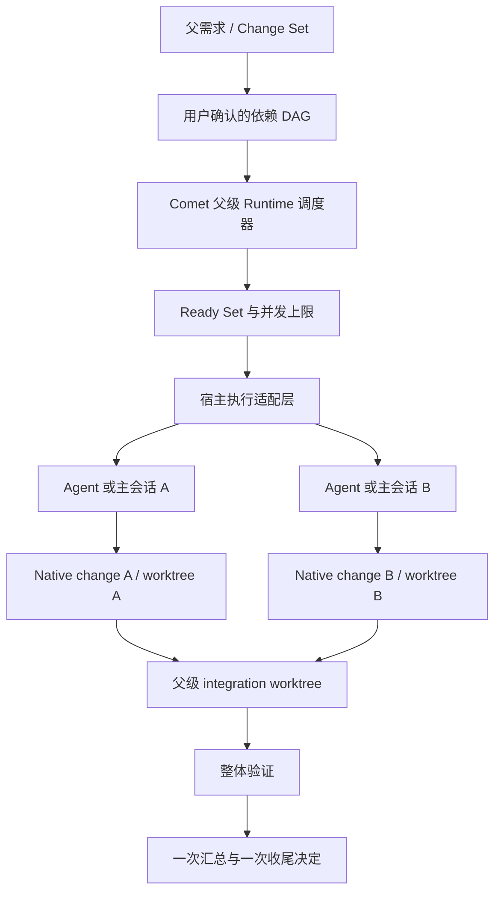

# 多 Change 依赖编排与多 Agent 架构调研

日期：2026-08-08  
范围：Comet Native、Claude Code、Codex、主流 Agent 编排与持久化工作流模式  
结论状态：建议做小范围原型，不建议直接做成纯 Supervisor Skill

## 结论摘要

用户描述的目标不是单纯的“多 Agent”，也不只是 Plan-and-Execute。更准确的定义是：

> **由 Agent 辅助规划、由 Runtime 持久化执行的依赖 DAG 编排，并允许宿主在可用时用多个 Agent 并行执行。**

它同时包含四类能力：

1. **规划**：把一个父需求拆成多个 change，并提出依赖关系；
2. **调度**：根据依赖图计算当前可运行的 change，控制并发和顺序；
3. **执行**：一个或多个 Agent 在隔离 worktree 中推进各自的 Native change；
4. **恢复与集成**：进程中断后继续，按依赖把代码合入统一集成分支，完成整体验证与最终汇总。

业界已经分别产品化了这些局部能力，但截至本次调研，没有一个 Claude Code 或 Codex 功能同时完整解决：

- 多 change 的显式依赖图；
- 每个 change 的独立、可恢复状态机；
- 依赖 change 对上游源码提交的真实继承；
- worktree 隔离；
- 跨会话恢复；
- 最终单一集成分支、整体验证和汇总。

因此，这个方向适合 Comet，但适合的形态是 **Native 之上的可选父级编排层**，而不是修改每个 Native change 的状态机，也不是依赖某个宿主的 Supervisor API。

## 1. 这类架构应该叫什么

几个常见术语描述的是不同维度，不能互相替代：

| 术语                        | 描述的核心                                 | 单独使用的不足                                   |
| --------------------------- | ------------------------------------------ | ------------------------------------------------ |
| Supervisor / Manager-Worker | 一个主 Agent 分派、监督并汇总多个 Worker   | 调度决策仍可能只存在于模型上下文，重启后不可恢复 |
| Plan-and-Execute            | 先生成计划，再逐步执行或重新规划           | 通常不天然表达并行、fan-in 和源码依赖            |
| DAG Scheduler               | 用有向无环图表达依赖，计算 ready set       | 只解决执行顺序，不负责如何理解需求               |
| Durable Workflow            | 通过事件、checkpoint、幂等执行恢复长期任务 | 本身不决定如何拆分软件需求                       |

最适合 Comet 的组合是：

> **Durable DAG Orchestration with an Optional Supervisor**  
> 带可选监督者的持久化 DAG 编排

Supervisor 是可替换的智能角色；DAG 与 Runtime 才是可靠性边界。

## 2. Comet 当前已经具备什么

本次核对了 beta17 工作区中的 Native、Engine、worktree 与现有 authoring DAG 实现。

### 2.1 已有基础

- Native 已经以单个 change 为边界提供 `shape → build → verify → archive` 状态机。
- `comet native status --json` 会发现已登记 Git worktree，并返回每个 change 的实际 workspace、phase 与 `continuation`。
- 当一个物理工作目录已有 active change 时，新 change 必须使用独立 worktree；Runtime 也会校验 change branch 与 target branch 的绑定。
- 每个 change 的 `continuation` 已明确区分 `continue`、`await-user`、`blocked` 和 `done`。
- `domains/engine/*` 已有 `RunState`、trajectory、checkpoint、resume 和 guardrail 等可复用概念。
- Comet Any 的 authoring 流程已经有一个窄领域静态 DAG：wave 1 并行、wave 2 依赖 script lane、最后经过 review barrier。
- 新增的 Native 并行 worktree CI 场景已经验证真实 linked worktree、进程级隔离、手动修改业务源码后的恢复，以及 Runtime 不应互相阻塞；该测试明确没有覆盖 Agent 调度。

### 2.2 当前缺口

当前 Native 的权威状态仍然属于“一个 change”：

- 没有父需求或 change set 的状态；
- 没有 change 之间的依赖边；
- 没有 ready set、worker claim、并发上限或失效 worker 的恢复；
- 没有统一的 integration branch/worktree；
- 每个 change 各自执行 archive/merge/push/PR，没有父级一次性收尾；
- Engine 当前是单 run 的步骤循环，不是多个 Native change 的项目级调度器。

所以 Comet 已经解决了“一个 Worker 如何可靠推进一个 change”，但还没有解决“谁按依赖组织多个 Worker 和多个 change”。

## 3. Claude Code、Codex 与业界现状

### 3.1 Claude Code

Claude Code 当前提供了三种非常接近但边界不同的能力：

1. **Agent Teams**
   - 主会话作为 team lead，维护共享 task list 和 mailbox；
   - task 可以依赖其他 task，未满足依赖的任务不能被领取；
   - teammate 可领取下一个未分配且未阻塞的任务，领取过程有文件锁；
   - 但该功能仍是 experimental，in-process teammate 不能随 `/resume` 恢复，task 状态滞后还可能人工阻塞后继任务；
   - Agent Teams 本身不为 teammate 自动提供 worktree 隔离，官方建议按文件所有权分区。

2. **Dynamic Workflows**
   - Claude 为任务生成可检查、可保存和重跑的 JavaScript 编排脚本；
   - Runtime 执行脚本，支持并行 pipeline、循环、阶段和最终综合；
   - 相比 Supervisor，它把“下一步做什么”从模型上下文移到了代码；
   - 但恢复只保证在同一 Claude Code session 中，退出后会重新开始；运行中除权限提示外不能插入用户决策，也不是项目级 change 状态机。

3. **`/batch` Skill**
   - 把大型代码变更拆成 5–30 个独立单元；
   - 每个单元使用独立 worktree、运行测试并创建 PR；
   - 它很适合大规模独立迁移，但官方定义就是“独立单元”，不负责混合依赖 DAG 和单一集成结果。

这说明 Claude Code 已经验证了三件事：依赖任务列表有价值、编排脚本比纯提示词更可重复、写代码的并行 Worker 应使用 worktree。它尚未把三者统一成可跨会话恢复的多 change 产品模型。

### 3.2 Codex / OpenAI

Codex 当前已具备：

- subagent 并行委派与结果汇总；
- 自定义 agent；
- 每个 chat 独立的 Goal 长任务；
- Codex 桌面端 worktree chat 和 handoff；
- Responses API 的 Multi-agent beta；
- Agents SDK 的 manager-style `agents as tools` 与 handoff 两种编排方式。

这些能力足以让一个主 Agent 临时把独立工作分给多个 Worker。OpenAI 的 Multi-agent 文档同时明确指出：当步骤直接依赖前一步、多个 Agent 会争用共享可变资源，或需要固定确定性执行图时，更适合单 Agent 或应用自己持有编排。

本次官方文档中没有发现 Codex 已提供“一个项目级 Goal 自动持久化多个 worktree change 的依赖 DAG，并在跨会话恢复后继续统一集成”的产品能力。这是基于已公开文档的推断，不代表内部或未来版本没有相关能力。

### 3.3 通用框架

- **LangGraph** 明确区分 predetermined workflow 与动态 agent，提供 orchestrator-worker、并行节点、显式图和 checkpoint/persistence。
- **AutoGen GraphFlow** 支持顺序、并行、条件和循环的有向图，适合需要严格顺序的多 Agent 流程，但官方仍标记为 experimental。
- **Temporal** 代表成熟的 durable workflow 思路：事件历史是恢复依据，工作流代码可在进程或基础设施失败后重建状态；有副作用的工作应放入可重试、幂等的 Activity。

这些框架说明成熟做法不是让 Supervisor 凭记忆调度，而是让确定性 Runtime 保存状态，Agent 作为可失败、可重试的执行单元。不过，直接把 LangGraph 或 Temporal 引入 Comet 会明显增加依赖、部署和平台负担；Comet 当前已有轻量状态与恢复基础，更适合吸收原则而不是嵌入完整框架。

### 3.4 能力对比

| 能力                     | 依赖顺序                   | 写隔离             | 中断恢复                | 与 Comet 目标的主要差距                          |
| ------------------------ | -------------------------- | ------------------ | ----------------------- | ------------------------------------------------ |
| Claude Agent Teams       | 共享任务支持依赖           | 不自动用 worktree  | teammate 跨恢复较弱     | experimental，状态可能滞后，缺少 change/集成语义 |
| Claude Dynamic Workflows | 脚本可表达阶段、循环、并行 | 由 Worker/脚本安排 | 仅同一 session 内恢复   | 不是项目级持久状态，退出后重跑                   |
| Claude `/batch`          | 只面向独立单元             | 每单元 worktree    | 以独立 Worker/PR 为主   | 不支持混合依赖与单一集成结果                     |
| Codex subagents          | 主 Agent 临时决定          | 可配合 worktree    | 结果属于当前任务/会话   | 无公开的持久化多 change DAG                      |
| Codex Goal + worktree    | 每 chat 一个长任务         | 每 chat 可隔离     | 单 chat 可暂停/恢复     | 多 Goal 仍是多个独立 chat，依赖需人工组织        |
| LangGraph / AutoGen      | 显式图、条件与并行         | 应用负责           | LangGraph 有 checkpoint | 是框架，不理解 Git/Native change                 |
| Temporal                 | 确定性工作流               | 应用负责           | 强持久化恢复            | 对本地 CLI/Skill 产品过重                        |

## 4. 推荐的 Comet 架构

### 4.1 新增父级 Change Set，不改子 change 状态机

引入一个轻量父级概念，暂称 **Change Set**：一个用户目标及其多个 Native child changes。

- 每个 child 仍是完整、可单独恢复的 Native change；
- Change Set 只拥有依赖、调度、集成和整体完成状态；
- child 不反向持有其他 child 的运行细节；
- 即使父级 Runtime 损坏，用户仍能进入任一 child 手动继续，不应被父级阻塞。



### 4.2 用户文档与机器 Runtime 分开

建议沿用 Comet 当前的分层原则：

- Git 中保留用户可读、可审查的 Change Set 计划，例如：
  - 父需求与验收标准；
  - child change 列表；
  - `depends_on`；
  - 计划 revision；
  - 最终整体验证要求。
- `.comet/runtime/` 中保存机器运行状态，例如：
  - ready/running/blocked/integrated 投影；
  - worker lease 与 attempt id；
  - dispatch receipt；
  - event log/checkpoint；
  - 宿主 session/thread id；
  - 临时汇总。

计划是可移植契约；Runtime 是可重建缓存和恢复加速器。父级 Runtime 缺失时，应从计划、child `comet-state.yaml`、Git branch/worktree 和验证证据重建可运行状态，而不是拒绝用户继续。

### 4.3 Runtime 持有调度，Agent 持有判断

Agent 可以：

- 读取父需求并提出拆分；
- 建议依赖关系；
- 为每个 child 生成边界清晰的 brief；
- 执行 child change；
- 提出 replan；
- 生成最终人类可读汇总。

Runtime 必须确定性负责：

- 校验 change 名称、依赖存在与 DAG 无环；
- 计算 ready set；
- 限制并发；
- 为 worktree/branch/child attempt 发放唯一 claim；
- 防止同一 child 被两个 Worker 同时推进；
- 记录状态转换和完成 receipt；
- 拒绝旧 attempt 的迟到回报；
- 决定集成顺序；
- 在失败、暂停或重启后重新计算下一步。

模型不应通过一句“任务完成”解除依赖。依赖只能由可验证的 child 状态、revision、证据和 Git commit 满足。

## 5. 最关键的设计点：依赖不只是等待

假设：

- A 新增领域 API；
- B 修改 CLI 使用 A；
- C 独立更新文档；
- D 添加依赖 A+B 的端到端测试。

图可以是：

```text
A ──> B ──> D
C ────────> D
```

A 与 C 可以并行，但 B 不能只“等 A 显示 done”后仍从旧 master 创建 worktree。B 的源码基线必须实际包含 A 的 verified commit，否则依赖只存在于状态文字里，代码并没有继承关系。

为了避免一开始引入多种边类型，MVP 应采用一个保守规则：

> `B depends_on A` 表示 B 只有在 A 通过验证并进入父级 integration branch 后才能创建或重基其 worktree；B 的 base commit 必须包含 A。

这会牺牲一部分理论并行度，但语义简单、可测试，也不会产生“状态上有依赖、源码上无依赖”的假顺序。将来确有性能需求时，再区分逻辑依赖、源码依赖和仅集成顺序依赖。

## 6. 推荐执行流程

1. Agent 在 Shape 阶段提出 child changes 与依赖 DAG。
2. 用户一次确认拆分、依赖和最终验收；Runtime 固化 plan revision。
3. Runtime 创建父级 integration branch/worktree，并计算初始 ready set。
4. 宿主适配层在并发上限内派发 ready children：
   - Codex/Claude 支持 subagent 时并发派发；
   - 宿主不支持时，由同一个 Agent 按 ready set 顺序执行；
   - 两种方式使用完全相同的 Runtime 状态与结果契约。
5. Worker 进入自己的 worktree，只按该 child 的 Native `continuation` 推进。
6. child 达到 verified 后，父级集成器串行把结果合入 integration branch。
7. 集成成功后，Runtime 才解除后继 child；后继基于新的 integration commit 开始。
8. 一个 child blocked 只阻塞它的 descendants；无关分支继续执行。
9. 所有 child 集成后，在 integration worktree 运行父级验证。
10. Agent 生成一次总览，用户只做一次最终 merge/push/PR/keep 决定。

## 7. 宿主适配与跨平台边界

Comet 不应要求所有宿主提供统一的“spawn agent”能力。正确边界是：

- **正确性不依赖多 Agent**：单 Agent 顺序执行必须永远可用；
- **多 Agent 是加速器**：宿主有 subagent/team/workflow API 时使用 bounded parallelism；
- **Runtime 不保存模型上下文作为权威状态**：只保存 worker identity、attempt、输入摘要和可验证输出；
- **Skill 是控制面**：负责让宿主 Agent 调用 Runtime 和派发能力；
- **Runtime 是事实源**：负责 ready/blocked/integrated 和恢复。

这样 Comet 可以在 Codex、Claude Code 或没有多 Agent 功能的平台上保持相同语义，只是执行速度不同。

## 8. 如何保证 Runtime 不会卡住用户

父级编排必须继承并加强 Native 的“可恢复而不垄断用户目录”原则：

- 状态锁只包围一次很短的原子更新，绝不跨越模型调用、测试或等待用户；
- Worker 使用可过期 lease，而不是永久 lock；
- lease 过期后先检查 child 与 Git 的真实状态，再安全地重新领取；
- completion 以 `(planRevision, child, attemptId, childRevision, commit)` 去重；
- 旧 Worker 的迟到结果不能覆盖新 attempt；
- 父级 Runtime 缺失或损坏不能阻止用户直接恢复 child；
- 手动修改业务源码由 child Native 的 snapshot/continuation 处理，父级只重新投影状态，不把 dirty source 当作永久占用；
- 集成冲突应保存所有 child 分支并把 integration lane 标为 blocked，不持有全局锁，也不停止无关 child；
- 支持显式退出自动编排，回到当前手动多 change 流程。

这不需要常驻 daemon。每次 `status`、resume 或 Worker 回报都可以触发一次确定性 reconciliation。

## 9. 最小可行范围

### 应该进入 MVP

- 单仓库；
- 仅 Native child changes；
- 用户确认后的静态 DAG；
- 无环校验与 ready set；
- 每个运行中的 child 一个独立 worktree；
- 一个父级 integration branch/worktree；
- 2–4 个 Worker 的有界并发；
- 不支持多 Agent 时自动顺序降级；
- stale lease 与重复回报恢复；
- 父级状态总览；
- 一次整体验证与一次收尾决定。

### 不应该进入首版

- 嵌套 Supervisor 或 Agent 自建子团队；
- 运行中静默修改 DAG；
- 跨仓库依赖；
- 常驻分布式调度服务；
- Agent 间自由聊天或 mailbox；
- 自动解决所有 Git 冲突；
- 默认多 Reviewer、多模型投票；
- 为每个调度动作新增独立 CLI 命令。

CLI/Skill 表面应尽量小：一个开始/恢复入口，加到现有 status 的父级视图即可。不要把内部 claim、lease、dispatch、integrate 都暴露为用户命令。

## 10. 推荐分阶段验证

### 阶段 0：单 Agent 调度原型

- 用户或 Agent 提供一个 3–4 节点静态 DAG；
- Runtime 只计算 ready set、创建正确基线的 worktree、串行集成；
- 同一 Agent 在不同 worktree 间推进；
- 先证明依赖、恢复和集成语义正确。

### 阶段 1：宿主多 Agent 加速

- 为 Codex/Claude 的 subagent 能力增加薄适配；
- 同时运行独立 ready children；
- Worker 只通过 claim/receipt 与父级 Runtime 协作；
- 主 Agent 仅监控例外和最终汇总。

### 阶段 2：经证据驱动的增强

只有真实使用显示必要时，才考虑显式 replan、软依赖、跨仓库或专门 reviewer lane。

## 11. 必须有的无模型测试

此能力不能只靠 prompt/eval 证明。最少需要以下确定性 CI 场景：

1. A 与 C 同时 ready；B 在 A 未集成前绝不能开始；D 等待 B 与 C。
2. B worktree 的 base commit 必须包含 A 的 verified commit。
3. 两个 Worker 竞争同一 child 时，只有一个 claim 成功。
4. Worker 被终止后 lease 可回收，child 能从 Native continuation 恢复。
5. 用户在 child worktree 手动修改业务源码后，父级 status/resume 不死锁、不覆盖源码。
6. 删除父级 Runtime 后，可以从计划、child state 与 Git 重建 ready/blocked 状态。
7. 同一 completion receipt 重放不会重复集成或推进后继。
8. 旧 attempt 的迟到完成不会覆盖新 attempt。
9. 一个 child 或集成步骤冲突时，无关 ready branch 仍能继续。
10. 任何两个并行 child 都不能共享 physical worktree、change branch 或运行时锁。

建议把这些场景扩展到现有 Native 真实 linked-worktree 测试体系中，而不是模拟成同一项目根目录下的多个文件夹。

## 12. 最终建议

### 是否适合 Comet

**适合。** Comet 比通用 Supervisor 更接近正确落点，因为它已经拥有 change、phase、evidence、continuation、worktree、recovery 和 archive 等领域事实。新增父级编排可以复用这些事实，而不必重新发明 Worker 内部生命周期。

### 应该如何定位

不要把它宣传成“Comet 多 Agent 框架”。更准确的用户价值是：

> 一个需求拆成多个 change 后，Comet 自动按依赖安排可并行和必须顺序的工作，发生中断时可恢复，最后交付一个经过整体验证的结果。

### 最重要的产品约束

- 一份父级计划；
- 一次依赖确认；
- 一个统一状态视图；
- 一次最终交付决定；
- 多 Agent 可用时更快，不可用时仍正确；
- Runtime 丢失或 Worker 崩溃不能把用户卡住。

如果阶段 0 不能用无模型测试稳定证明“依赖源码继承、崩溃恢复、无永久锁、单一集成结果”，就不应继续增加 Supervisor 或动态 replanning。反过来，如果这些确定性基础成立，多 Agent 只是自然的执行加速层。

## 一手资料

### OpenAI / Codex

- [Codex Subagents](https://developers.openai.com/codex/subagents)
- [Codex Git worktrees](https://learn.chatgpt.com/docs/environments/git-worktrees)
- [ChatGPT/Codex long-running work and Goal mode](https://learn.chatgpt.com/docs/long-running-work)
- [Responses API Multi-agent](https://developers.openai.com/api/docs/guides/responses-multi-agent)
- [OpenAI Agents SDK orchestration and handoffs](https://developers.openai.com/api/docs/guides/agents/orchestration)

### Anthropic / Claude Code

- [Run agents in parallel](https://code.claude.com/docs/en/agents)
- [Agent Teams](https://code.claude.com/docs/en/agent-teams)
- [Dynamic Workflows](https://code.claude.com/docs/en/workflows)
- [Commands, including `/batch`](https://code.claude.com/docs/en/commands)
- [Git worktrees](https://code.claude.com/docs/en/worktrees)

### 编排与持久化框架

- [LangGraph workflows and agents](https://docs.langchain.com/oss/python/langgraph/workflows-agents)
- [LangGraph persistence](https://docs.langchain.com/oss/python/langgraph/persistence)
- [AutoGen GraphFlow](https://microsoft.github.io/autogen/dev/user-guide/agentchat-user-guide/graph-flow.html)
- [Temporal Workflows](https://docs.temporal.io/workflows)
- [Temporal Activities](https://docs.temporal.io/activities)
